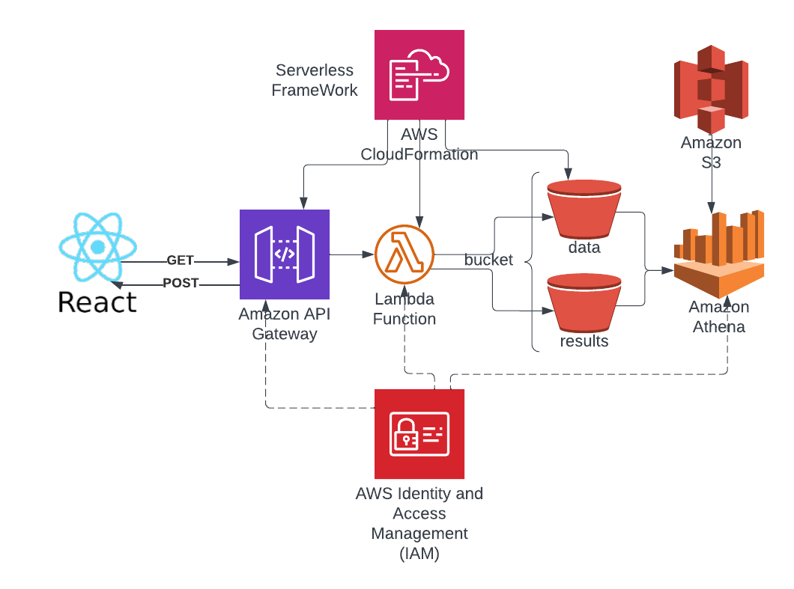

# Project 3 Personal Health Recorder(TDEE Tracker)

This project is a simple TDEE (Total Daily Energy Expenditure) tracker built using React. It takes user's information, calculates TDEE, and saves the data to Amazon Athena. The app also displays the history of the user's inputs.
## Project Structure

- `frontend`: Contains the React front-end application.
- `backend`: Contains the serverless back-end configuration and Lambda function code.

### Frontend Setup

## Setup and Installation
1. Make sure you have Node.js and npm installed on your system.
2. Clone the repository or download the project files.
3. Open a terminal/command prompt in the project folder and run npm install to install the required dependencies.
4. Replace `<your_api_gateway_url>` in the `App.js` file with your actual API Gateway URL.
5. Start the development server by running `npm start`.

The app should now be running on `http://localhost:3000`.

Here we apply the gateway API for access Serverless function:
https://gfidvgzqod.execute-api.us-east-1.amazonaws.com/dev/results

Please make sure your CORS is properly set with `Access-Control-Allow-Origin` set to be `Allow All` or `*`.

## Project AWS Structure

1. The React front-end sends HTTP requests to the API Gateway.
2. The API Gateway forwards the requests to the Lambda function.
3. The Lambda function processes the requests, interacts with Amazon Athena to store or retrieve data, and returns the results.
4. The API Gateway sends the results back to the React front-end application.
5. Amazon Athena uses the my-tdee-data-bucket to store the query results.